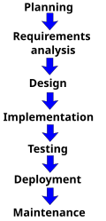
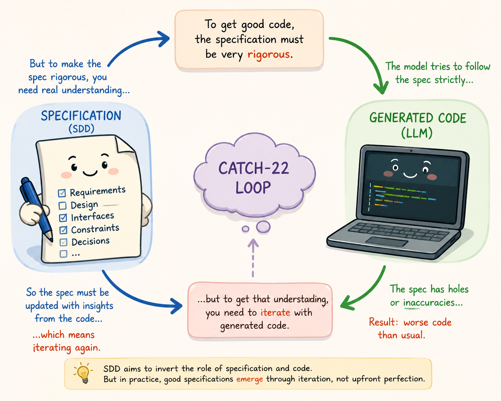

# Why Specification-Driven Development (SDD) is Not a Silver Bullet for AI-Assisted SDLC

*Using a popular SDD framework and a concrete example*

---

Specification-Driven Development is one of the better ideas to emerge from the
current AI coding wave. Instead of jumping straight from a vague prompt to generated
code, SDD forces the developer and the coding agent to first produce structured
specifications, clarify requirements, define acceptance criteria, and create an
implementation plan. That is valuable.

But we should be careful not to confuse better prompting discipline with fully
autonomous software development.

At execution time, even the most sophisticated SDD workflow still becomes model
context. The specification, plan, constraints, guardrails, and task breakdowns are
eventually passed to the LLM and interpreted by the model. SDD improves the quality
of that context. It does not remove the model's limitations.

This is similar to why chain-of-thought-style decomposition often helps. A detailed,
structured intermediate representation usually produces better results than a vague
one. But it does not magically give the model architectural judgment, domain
understanding, library selection discipline, or long-horizon engineering reliability.

The holy grail every business is seeking is fully autonomous software development.
The models at this time are not at that level, even with better upfront planning and
frameworks like SDD.

To be clear, I am not dismissing SDD. Quite the opposite. I plan to keep using
Spec Kit or similar frameworks in future projects. They reduce boilerplate prompting,
impose structure on vibe coding, and make AI-assisted development more disciplined.

But my experiment showed the boundary clearly. I tried using SDD for a real-world
feature with GitHub Spec Kit v0.8.9 and Claude Code using Claude Opus 4.7. The result
was impressive in many ways. The generated structure was useful. The implementation
flow was better than plain prompting. But as I suspected, it failed in selecting the
correct libraries and frameworks to use.

The experiment also gives empirical grounding to this article: fully autonomous
development with SDD as of now does not work optimally for all projects.

---

## Background: Who Is Writing This

I have been a professional programmer and software engineer for over 20 years, working
across C++, Java, Scala, Python, Go, and more frameworks and paradigms than I can
count. I have written software for telecom network management, optimization, and
frequency planning — domains where correctness, scale, performance, and
maintainability are not optional.

So when people with limited real-world experience show up declaring that specs are the
silver bullet for software development, my mind immediately goes back to
*The Mythical Man-Month*. This is a 40-year-old book. Very few read it now, but it
has deep meaning still.

Fred Brooks wrote:

> "The complexity of software is an essential property, not an accidental one. Hence
> descriptions of a software entity that abstract away its complexity often abstract
> away its essence."

In essence: a specification, if abstracted, will abstract away the essence. Code
remains the ultimate specification — a specification can never be as detailed as the
code itself. It is essentially a loose abstraction.

From the same chapter:

> "I believe the hard part of building software to be the specification, design, and
> testing of this conceptual construct, not the labor of representing it … We still
> make syntax errors, to be sure; but they are fuzz compared with the conceptual
> errors in most systems. If this is true, building software will always be hard.
> There is inherently no silver bullet."
>
> — Fred Brooks, [No Silver Bullet](http://sunnyday.mit.edu/16.355/BrooksNoSilverBullet2.html)

There are no silver bullets in software development. This was true 40 years ago; it
is true now with AI-driven development. Instead of *Mythical Man-Month*, one could
write *Mythical AI Speedup* and be pretty close to the truth.

When I started my career, Rational Rose was one of the most hyped tools in the
market. UML was treated as the silver bullet of its decade: draw boxes, arrows, and
diagrams, and the tool would magically turn them into working code. I was skeptical
then, and I never bought into the idea that diagrams alone could replace engineering
judgment. The hype eventually faded as the industry learned the same lesson.

When the current excitement around Specification-Driven Development started, I had a
familiar reaction. However, SDD has revived a lot of best practices that were
generally left for dead — upfront analysis, planning, design, Test-First /
Test-Driven Development. That part is genuinely good.

---

## SDD in the Context of AI-Native SDLC

### What is SDLC, Really?

SDLC was an acronym long absent from most modern programmers' vocabularies —
associated more with Waterfall methodology than anything else. Amazon's AI-focused
IDE Kiro brought it back into circulation, reframing it as the backbone of an
"AI-native SDLC" (or AIDLC).

What it describes, at its core, is the Analyze → Design → Implement cycle.



People mistakenly think SDLC means Waterfall. Iterative methodologies like Scrum and
Agile follow exactly the same phases — the scope is simply limited to a subset of the
feature list, usually one Feature at a time, broken down into User Stories and Tasks,
with automated CI/CD pipelines in almost all modern organisations. Dismissing SDLC or
associating it with all the old problems of Waterfall is not correct.

If you use SDD to develop an entire product or large feature — an Epic in Scrum
parlance — and give it a prompt like "I want to build a new database system", the
scope is large, the artefacts generated are enormous, and the task list is huge.
There is some sense to this criticism when SDD is used at that scale.

If the entire project is specified in one go, it is impossible for a human to process
so much cognitive load in one shot, or even across a few days. The result is that the
specifier eventually gives up and becomes like an overworked clerk blindly signing
documents, pressing "Yes" or "OK — Continue" in the SDD-driven agentic loop.

However, SDD can be done for a smaller feature subset, and that is the better way to
use it.

Another pushback against SDD is that AI models are non-deterministic, so a
specification can be interpreted differently by different models or the same model at
different times. This is not a major problem in practice. SDD frameworks act as
structured prompts, and modern models produce highly consistent outputs when guided
by them.

### The Real Problem: Why Code Becomes the Source of Truth — and Why That Is a Good Thing

Good design and algorithmic ideas are crafted while coding. This is a simple truth
evident to everyone who has written and shipped complex software — and not obvious to
those who have not.

This is why the initial analysis and design specification inevitably gets outdated and
code becomes the source of truth. SDD tries to invert that relationship. Its
fundamental thesis is that it is possible to specify good design upfront without
tinkering with the code and without prototyping. That thesis is fundamentally wrong.

The counter-argument is the strength of the code-generating AI model — that models
are powerful enough to "craft" the best design, library, and framework decisions. But
with strict SDD this becomes more of a problem even for very capable models, as the
framework tries to follow the specification strictly, and the specification has holes
or inaccuracies, resulting in code that is worse than what plain prompting would
produce.

This is a Catch-22. The specification has to be very rigorous in the first place, but
to become rigorous it needs to be iteratively refined alongside the generated code.



In the case of fully autonomous coding, the LLM does autoregressive generation of
code and design just as it writes out a poem. No refactoring or rework. We just have
to hope the prompt or specification is good enough. The amount of code generated is
so rapid and large that it is impossible to manually review or refactor.

Fully autonomous coding is good for Rapid Prototyping or Proof of Concept — but not
for Production.

---

## Part 2: An End-to-End Experiment to Test the SDD Thesis

To test this limitation concretely, I ran an end-to-end experiment using Spec Kit,
a popular Specification-Driven Development framework. I do not think the result is
specific to Spec Kit alone — I would expect a similar pattern with OpenSpec, BMAD,
or any comparable framework that moves from specification to implementation through
an AI coding agent.

The feature I chose was realistic and non-trivial: a Python module for working with
US elevation data across USGS 3DEP/NED tiles. I had worked on this problem before,
so I already knew the kind of architecture that eventually emerged from real
implementation.

The goal was simple: would an SDD flow surface a similar architecture on its own?

---

## III. The Experiment: Speckit End-to-End

> Notes from a single-session experiment running the Speckit framework end-to-end on a
> realistic Python module (US elevation profile over USGS 3DEP NED tiles), then
> stress-testing the resulting plan with a domain-driven alternative.
>
> All quoted excerpts cite line numbers in
> [`speckit_user_claude.txt`](./speckit_user_claude.txt) (the recorded transcript),
> [`.specify/memory/constitution.md`](./.specify/memory/constitution.md),
> [`specs/001-us-elevation-profile/spec.md`](./specs/001-us-elevation-profile/spec.md),
> and [`specs/001-us-elevation-profile/plan.md`](./specs/001-us-elevation-profile/plan.md).
> The references are reproducible — open the file at the line number and read the
> surrounding context yourself.

### Tools and Environment

- `uv tool install specify-cli --from git+https://github.com/github/spec-kit.git@v0.8.9`
- Claude Code (latest) with the Claude Opus 4.7 model

Followed the phases outlined in the Speckit documentation
(<https://github.com/github/spec-kit>): Init → Constitution → Specify → Clarify → Plan.

---

### Phase 1 — `/speckit.constitution`

**Transcript:** [`speckit_user_claude.txt:10`](./speckit_user_claude.txt) — user input.

```
/speckit.constitution Create principles focused on code quality, test driven development
consistency, and performance requirements
```

The agent produced [`.specify/memory/constitution.md`](./.specify/memory/constitution.md)
with four non-negotiable principles (Code Quality, TDD, Consistency, Performance).
The principles themselves are reasonable. **Two of them quietly load the dice for
later phases:**

**Principle III — Consistency**

> "New dependencies MUST be justified in writing: problem solved, alternatives
> considered, license verified. Adding a dependency that duplicates an existing one's
> purpose is forbidden." — `constitution.md:106`

Sensible in isolation. But it creates an asymmetric cost: **the stdlib option always
wins ties** because it costs zero justification entries. This becomes decisive in
Phase 4.

**Principle IV — Performance Requirements**

> "Every feature plan MUST declare measurable performance budgets in `plan.md` …
> A regression exceeding 5% on a declared budget MUST block merge until either fixed
> or formally re-baselined with documented justification." — `constitution.md:119–126`

Also sensible. But the budget is declared *before* the architecture is chosen. Once a
number is on paper, it becomes the criterion against which all future architectures
are judged — even when the number was a guess.

**Phase verdict:** Good. The constitution itself is fine. The hidden tax — that
stdlib beats deps and that early-declared budgets harden into gates — is invisible
at this stage.

---

### Phase 2 — `/speckit.specify`

**Transcript:** [`speckit_user_claude.txt:496–497`](./speckit_user_claude.txt) — user input.

```
/speckit.specify I want a module in python to store US elevation data files and between
two points of latitude, longitude - of receiver and transmitter
```

A single sentence. No mention of scale, format, accuracy, latency, or deployment
context. The kind of thing a teammate would clarify in chat before opening a doc.

The agent produced a spec anyway. From the report at
[`speckit_user_claude.txt:1046–1054`](./speckit_user_claude.txt):

> "All 16 quality checks pass on the first iteration. No `[NEEDS CLARIFICATION]`
> markers remain. Three scope decisions were resolved as **Assumptions** rather than
> open questions:
>
> | Decision | Default chosen |
> |---|---|
> | Coverage area | Continental US (CONUS) only; Alaska/Hawaii/territories opt-in |
> | Data acquisition | User supplies files; no auto-download in v1 |
> | RF analysis scope | Elevation profile only; LOS/Fresnel/link-budget deferred |"

Two of those three assumptions were **wrong**. The first session's spec assumed
CONUS-only and a roughly hobby-scale dataset. The real target (revealed in Phase 3)
is full CONUS + Hawaii + Puerto Rico + Alaska, ~1,756 NED tiles, ~23 billion samples,
≈ 180 GB raw — a completely different architectural problem.

**Phase verdict:** The agent silently converted ambiguity into "assumptions" and
declared the spec complete. The 16 checklist boxes were green, the FRs were testable,
and the architectural drivers were still missing. The artefact looks done because
every template slot is filled — not because the engineering question is answered.

---

### Phase 3 — `/speckit.clarify`

**Transcript:** [`speckit_user_claude.txt:1083`](./speckit_user_claude.txt) onward.

This is the phase that actually worked.

[`speckit_user_claude.txt:1403–1406`](./speckit_user_claude.txt):

> "I scanned the spec against the clarification taxonomy. … The genuinely unresolved
> high-impact items are: dataset scale, supported source formats, and the performance
> budget for paths beyond 100 km."

Three questions, each driving a real architectural lever. The dataset-scale answer
([`speckit_user_claude.txt:1440–1442`](./speckit_user_claude.txt)) reset the entire
problem framing:

> User: "it is C full CONUS at native high resolution and also US territories like
> Puerto Rico, Hawaii. There are about 1756 NED files making a total 23 billion data
> points. Each data point is a 64 bit float."

A second clarify session then pinned tile-index persistence
([`speckit_user_claude.txt:2587–2603`](./speckit_user_claude.txt)) — and this is
where the framework's gravity began to assert itself. The agent presented three
options:

| Option | What's persisted |
|---|---|
| A | Nothing — rebuild every process start |
| B | Small metadata-index sidecar only (Recommended) |
| C | Metadata index + cached decoded tile payload on disk |

The user picked B. **B is reasonable, but it implicitly closes the door on a class
of architectures.** The "cached decoded payload" framing of option C made it sound
like a heavyweight extra; in reality, a single transcoded Zarr store is roughly that
same idea — but it is a different *product shape*, not an optional accelerator. The
clarify menu didn't present that shape as a peer option.

This is the most subtle failure in the framework: a clarify question's option *menu*
is itself a design decision, made by the agent, without the user being told it is one.

**Phase verdict:** The framework was net-positive up to and including clarify. The
questions were sharp; the dataset-scale answer saved hours of wrong-direction work.
The hidden cost is that menus phrased by the agent prune the design space silently.

> *Note: this also gave the agent room to deduce performance assumptions directly from
> the constitution — e.g., "5 min cold registration" — as if those numbers had been
> independently engineered. They had not. They were anchored by a feel for what "fast
> enough" sounded like for a clarify menu.*

---

### Phase 4 — `/speckit.plan`

**Transcript:** [`speckit_user_claude.txt:3015`](./speckit_user_claude.txt) onward.

The plan ([`specs/001-us-elevation-profile/plan.md`](./specs/001-us-elevation-profile/plan.md))
selected the following stack:

> "Index storage │ SQLite via stdlib `sqlite3` + `rtree` virtual table" —
> [`speckit_user_claude.txt:3323`](./speckit_user_claude.txt)
>
> "Sidecar index: SQLite via stdlib `sqlite3` — single-file
> `.us_elevation_profile_index.sqlite` … Stdlib-only (no new dependency); atomic
> writes; supports point-in-polygon queries via straightforward bbox filters" —
> [`plan.md:60–65`](./specs/001-us-elevation-profile/plan.md)

When asked to justify the choice
([`speckit_user_claude.txt:3470–3530`](./speckit_user_claude.txt)), the agent listed
four reasons:

> 1. "Stdlib, zero new dependency. … Under Principle III's 'new dependency must be
>    justified in writing' bar, that's the cheapest possible answer."
> 2. "Atomic single-row UPDATE is what FR-018 literally asks for."
> 3. "R-tree virtual table makes the spatial lookup an indexed query for free."
> 4. "WAL mode is crash-safe."

Re-read reason #1. **"Stdlib, zero new dependency"** is doing most of the work.
Principle III says new deps need a justification entry — so SQLite started ahead of
every other candidate by exactly one paragraph of writing the agent didn't have to
produce. The comparison was structurally unfair from the start.

The rejected alternatives table at [`speckit_user_claude.txt:3509–3519`](./speckit_user_claude.txt)
makes the pattern visible:

> | Alternative | Failed on |
> |---|---|
> | JSON sidecar | No atomic single-row update; full read-modify-write |
> | Parquet | Columnar scans are great, but updates rewrite the whole file. Plus a pyarrow runtime dep — **fails Principle III's bar** |
> | LMDB / BerkeleyDB | Fast KV, but no spatial indexing, harder to inspect, **extra dep** |
> | DuckDB embedded | Powerful query engine for a workload that's not analytical. **Extra dep** without a matching benefit |

Three of four rejections invoke Principle III's dependency bar. **The constitution
did the rejecting; the agent was just the microphone.**

**Phase verdict:** The plan is internally consistent and would pass review. It is
also a *local optimum*, reached by minimising friction against the constitution
rather than by reasoning about the problem.

---

## IV. The Necessity of Human Pushback

After the plan was committed
([`speckit_user_claude.txt:3424`](./speckit_user_claude.txt) — commit `4f1b85a`),
the user asked the obvious follow-up:

> "why did you chose Index storage │ SQLite via stdlib sqlite3 + rtree virtual table"
> — [`speckit_user_claude.txt:3465`](./speckit_user_claude.txt)
>
> "why not use zarr as a tensor store" —
> [`speckit_user_claude.txt:3534`](./speckit_user_claude.txt)
>
> "why not just transcode all files which is a one time activity into a zarr store;
> there is no 5 mt starup delay then" —
> [`speckit_user_claude.txt:3609–3610`](./speckit_user_claude.txt)

The agent's first response at
[`speckit_user_claude.txt:3569–3572`](./speckit_user_claude.txt):

> "The transcode cost blows past SC-008. SC-008 budgets 5 minutes for cold
> registration. … reading + decompressing + recompressing + writing through Zarr
> takes 10–30 minutes realistically."

**The constitution-derived budget is being used as the reason a better architecture
cannot be considered.** The 5-minute number was made up by the agent in Phase 2/3
with no engineering data behind it, and it has hardened into a constraint that
disqualifies designs.

Under user pushback, the agent walked it back
([`speckit_user_claude.txt:3616–3617`](./speckit_user_claude.txt)):

> "Fair push-back — and I want to be honest about where my prior answer overstated
> the case."

And conceded ([`speckit_user_claude.txt:3656–3660`](./speckit_user_claude.txt)):

> "You're right that I overweighted reason #2 ('blows past SC-008'). That's only true
> if we keep SC-008 framed as 'registration must be fast.' Re-framing registration as
> 'one-time setup that may take 30 min' is a perfectly reasonable spec change."

The Zarr design needed nothing in the spec that wasn't already there — except the
willingness to revise an arbitrary number the spec itself produced.

### The Right Stack: R-tree + Zarr

The user's proposal in
[`speckit_user_claude.txt:3704–3747`](./speckit_user_claude.txt) is a clean piece of
geospatial engineering anyone who has worked with NED tiles before would recognise:

```python
def openZarrDataSet(directoryStore, rows=NED_FILE_HEIGHT, columns=NED_FILE_HEIGHT):
    store = zarr.LMDBStore(directoryStore, readonly=True, lock=False)
    cache = zarr.LRUStoreCache(store, max_size=2**33)
    dataset = zarr.open(
        store=cache,
        shape=[10**3, 10**3, 1, rows, columns],
        chunks=[1, 1, 1, rows, columns],
        fill_value=float("NaN"),
        ...
    )
```

The architecture in three lines:

1. One-time transcode of GeoTIFFs into a Zarr store keyed by `(lat_idx, lon_idx)`,
   backed by LMDB (mmap'd random reads), wrapped in an `LRUStoreCache`.
2. An R-tree built from the per-tile bounding boxes of *actually registered tiles* for
   line-vs-tile intersection on profile queries.
3. Query path: pyproj geodesic line → R-tree intersect → chunk keys → Zarr reads →
   bilinear. No SQLite, no per-file rasterio open in the hot path, native support for
   the irregular US-territories footprint (Alaska is 1°×2°, Hawaii is sparse islands,
   Guam is a point).

This is better than the plan-of-record on three dimensions:

- **Right algorithmic tool**: R-tree is the textbook structure for line-segment
  intersection over irregular polygons. The plan-of-record embeds R-tree inside
  SQLite, adding row-store machinery the workload doesn't need.
- **Right storage tool**: chunked tensor reads are exactly what an elevation profile
  is. Zarr was built for this access pattern; rasterio + GeoTIFF is the legacy path.
- **Native heterogeneity**: irregular tile footprints are handled without any
  floor/ceil shortcut that would have to be debugged later.

An experienced engineer arrives at this design with two Google searches: "USGS NED
tile lazy access python" and "geospatial chunk store python". The Speckit agent,
penalised for new dependencies and offering clarify menus that never listed this
shape as an option, took the SQLite path.

---

## V. Conclusion & Takeaways

### Where Each Phase Actually Stood

| Phase | Net value | Failure mode |
|---|---|---|
| `/speckit.constitution` | Positive — principles are sound | Hidden tax: stdlib beats deps; early budgets harden into gates |
| `/speckit.specify` | Negative when input is vague | Silently converts ambiguity to "assumptions"; 16 green boxes ≠ specified |
| `/speckit.clarify` | **Strongly positive** | Menu choices prune the design space without saying so |
| `/speckit.plan` | Negative for non-trivial stacks | Defaults to the stack that passes the constitution cheapest, not the one that fits the problem |
| Post-plan pushback (human) | Required | Recovers the better architecture — but only if the user knows enough to ask |

The pattern: **the framework's quality peaks at clarify, then declines as the agent
accumulates enough scaffolding to commit to choices.** Each later artefact looks more
authoritative than the last (numbered FRs, gate tables, rejected-alternatives
matrices), but the underlying decisions are increasingly anchored to earlier arbitrary
numbers rather than to the engineering problem.

### The Review Hazard

Frameworks generate vast amounts of artefacts — sync impact reports, passing gate
tables, constitution checks, rejected-alternatives matrices. This makes the process
*look* rigorous. Which is exactly what makes critical human review easy to skip. The
friction sits in the wrong place: it is harder to read a 254-line plan critically
than to skim it approvingly.

### What This Means for Using Speckit or Any SDD Framework

1. **Treat "no new deps" constitution rules as biases, not neutrals.** They tilt
   every later decision toward stdlib stacks. If the better engineering answer
   requires a dependency, you will need to actively defend it; the framework will not.

2. **Treat measurable outcomes (SC-* numbers) as guesses until ratified by an
   engineer with domain knowledge.** The agent will quote them back at you later as if
   they were measured. They were not.

3. **Read every clarify menu as a design proposal in disguise.** The options listed
   are the design space the agent thinks exists. If the option you want is not on the
   menu, that is the failure — not "I should pick the best of these three."

4. **The plan phase is the worst time to discover an architectural mismatch.** Plans
   are long, internally consistent documents that are exhausting to revise. Push back
   during clarify, or before.

5. **A specification produced by an agent must be reviewed by an engineer willing to
   discard the agent's safe architectural choices** — not just fact-check its
   requirements. Without that review, the framework delivers a polished local optimum
   and calls it done.

Frameworks like Speckit and OpenSpec are genuinely good tools. The 12 functional
requirements, the bilinear-interpolation clarification, the no-data-segment shape —
all of those are better artefacts than what the user would have produced free-hand.
The lesson is narrower: **they are not silver bullets, and they are at their most
dangerous when they look the most rigorous.**

---

## Appendix — Quick Reference for Line Citations

| Source | What's there |
|---|---|
| [`speckit_user_claude.txt:10`](./speckit_user_claude.txt) | `/speckit.constitution` invocation |
| [`speckit_user_claude.txt:496`](./speckit_user_claude.txt) | `/speckit.specify` invocation — one-sentence input |
| [`speckit_user_claude.txt:1046–1054`](./speckit_user_claude.txt) | Three "assumptions" silently chosen by specify |
| [`speckit_user_claude.txt:1440–1442`](./speckit_user_claude.txt) | User overturns CONUS-only assumption with real scale |
| [`speckit_user_claude.txt:2587–2603`](./speckit_user_claude.txt) | Clarify option menu (B chosen; Zarr-shaped option not listed) |
| [`speckit_user_claude.txt:3323`](./speckit_user_claude.txt) | Plan selects SQLite + R-tree |
| [`speckit_user_claude.txt:3470–3530`](./speckit_user_claude.txt) | SQLite justification — "stdlib, zero new dependency" leads |
| [`speckit_user_claude.txt:3569–3572`](./speckit_user_claude.txt) | Zarr first rejected on SC-008 budget |
| [`speckit_user_claude.txt:3616–3617`](./speckit_user_claude.txt) | Agent walks back the rejection under pushback |
| [`speckit_user_claude.txt:3704–3747`](./speckit_user_claude.txt) | User's Zarr + R-tree proposal with working code |
| [`.specify/memory/constitution.md:106`](./.specify/memory/constitution.md) | Principle III "new deps must be justified" |
| [`.specify/memory/constitution.md:119–126`](./.specify/memory/constitution.md) | Principle IV performance-budget rule |
| [`specs/001-us-elevation-profile/spec.md:15`](./specs/001-us-elevation-profile/spec.md) | Clarified dataset scale (1,756 tiles, ~180 GB) |
| [`specs/001-us-elevation-profile/spec.md:125`](./specs/001-us-elevation-profile/spec.md) | SC-008 — the 5-minute budget that became a gate |
| [`specs/001-us-elevation-profile/plan.md:60–65`](./specs/001-us-elevation-profile/plan.md) | SQLite chosen as storage |
